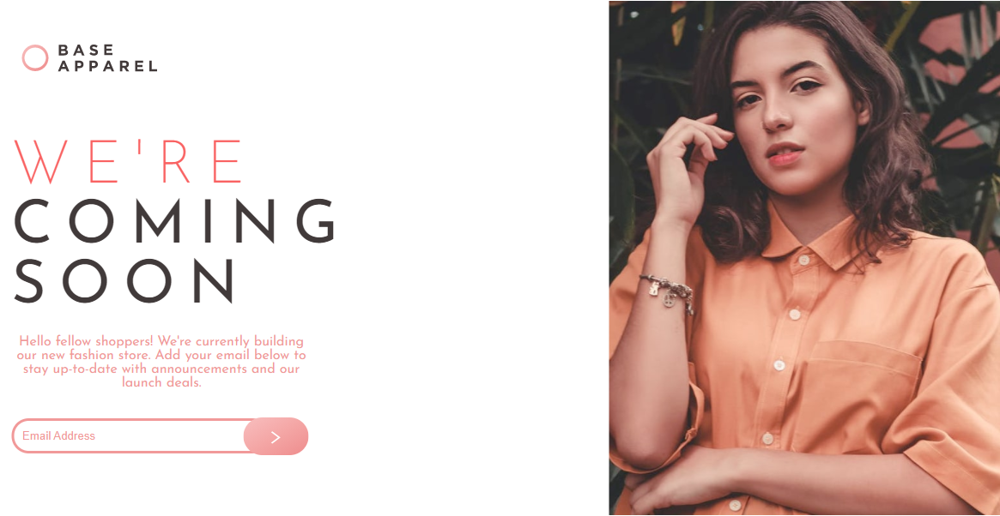

  
  
  
  

  

 
  
     
    
     
     
  

 <a href="#eye_speech_bubble-visualizar">Visualizar</a> •
 <a href="#information_source-sobre">Sobre</a> •
 <a href="#hammer_and_wrench-tecnologias">Tecnologias</a> • 
 <a href="#brain-conceitos-aplicados">Conceitos</a> •
 <a href="#sparkles-funcionalidades">Funcionalidades</a> •
 <a href="#boy-autor">Autor</a> •
 <a href="#balance_scale-licença">Licença</a>

---

## :eye_speech_bubble: **Visualizar**

Deploy do front-end efetuado no [Netlify](https://www.netlify.com/) para visualizar: [Clique Aqui](https://joaovitorsw-base-apparel-coming-soon-master.netlify.app/)

|                             :computer:Desktop                             |                             :iphone: Mobile                              |
| :-----------------------------------------------------------------------: | :----------------------------------------------------------------------: |
| <kbd></kbd> | <kbd></kbd> |

  
---

## :information_source: _Sobre_

Minha versão da aplicação proposta pelo [Frontend Mentor](https://www.frontendmentor.io/challenges/base-apparel-coming-soon-page-5d46b47f8db8a7063f9331a0) 

---

## :hammer_and_wrench: _Tecnologias_

| :globe_with_meridians: FrontEnd |
| :-----------------------------: |
| [HTML 5](https://www.w3schools.com/html/) |
| [CSS3](https://www.w3schools.com/css/) |
| [JavaScript ES6](https://developer.mozilla.org/en-US/docs/Web/JavaScript) |

---

## :brain: _Conceitos Aplicados_

|  :page_facing_up:  |
| :----------------: |
|    Mobile First    |
|     HTML Class     |
|     CSS Class      |
|      Position      |
|  Background Image  |
|  Pseudo Selectors  |
|   CSS Box Model    |
|  Size Properties   |
|      Flexbox       |
|     MediaQuery     |
|    Atomic Comit    |
| Element visibility |
|   Regex Pattern    |
|      Callback      |
|        Grid        |

---

## :sparkles: _Funcionalidades_

|       :page_facing_up:       |
| :--------------------------: |
| Validar um endereço de email |

---

## :boy: _Autor_

<a href="https://github.com/Joaovitorsw">
 
  
 <b>João Vitor Pereira dos Santos</b>
</a>

Desenvolvido com ❤️ por João Vitor Pereira dos Santos 👋🏽 Meus Contatos!

---

## :balance_scale: _Licença_

Copyright ©️ 2021 [João Vitor Pereira dos Santos ](https://github.com/gleisonkz). 
This project is licensed by [MIT](./LICENSE).

