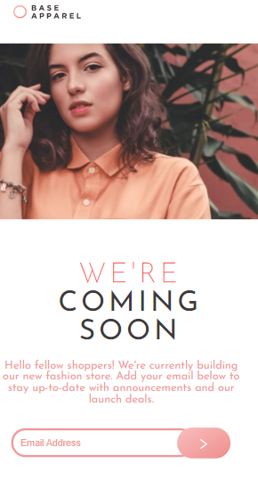

  
  
  
  

  

 
  
     
    
     
     
  

 <a href="#eye_speech_bubble-visualizar">Visualizar</a> •
 <a href="#information_source-sobre">Sobre</a> •
 <a href="#arrow_forward-executar">Executar</a> •
 <a href="#hammer_and_wrench-tecnologias">Tecnologias</a> • 
 <a href="#brain-conceitos-aplicados">Conceitos</a> •
 <a href="#sparkles-funcionalidades">Funcionalidades</a> •
 <a href="#boy-autor">Autor</a> •
 <a href="#balance_scale-licença">Licença</a>

---

## :eye_speech_bubble: **Visualizar**

Deploy do front-end efetuado no [Netlify](https://www.netlify.com/) para visualizar: [Clique Aqui](https://joaovitorsw-stats-preview-card.netlify.app/)

|                             :computer:Desktop                             |                             :iphone: Mobile                              |
| :-----------------------------------------------------------------------: | :----------------------------------------------------------------------: |
| <kbd></kbd> | <kbd></kbd> |

  
---

## :information_source: Sobre

Minha versão da aplicação proposta pela Next Level Week #05 da [Rocketseat](https://rocketseat.com.br/) 🚀

---

## :arrow*forward: \_Executar*

Para executar esse projeto você precisa baixar este repositório, ter o Gerenciador de Pacotes do Node ([`NPM`](https://www.npmjs.com/get-npm)) ou o Gerenciador de Pacotes YARN ([`YARN`](https://yarnpkg.com/getting-started)) instalado.

🌐 FrontEnd

Abra o prompt de comando no diretório do projeto na pasta ng-podcastr, e execute os seguintes códigos:

  
<i>com <b>npm</b></i>

  
  bash
  # Instalar dependências
  $ npm install ou npm i

# Iniciar o servidor de desenvolvimento

$ ng serve --open ou ng s -o

`

<i>com <b>yarn</b></i>

bash

# Instalar dependências

$ yarn install

# Iniciar o servidor de desenvolvimento

$ ng serve --open ou ng s -o

`

> ⚠️ O servidor de desenvolvimento será iniciado na porta: 4200 - Acesse <http://localhost:4200>

---

🖥 BackEnd

Abra o prompt de comando no diretório do projeto na pasta ng-podcastr, está é a pasta onde esta localizado o db.json, e execute os seguintes códigos:

<i>com <b>npm</b></i>

bash

# Iniciar o servidor de desenvolvimento

$ npm run json

<i>com <b>yarn</b></i>

bash

# Instalar dependências

$ yarn install

# Iniciar o servidor de desenvolvimento

$ yarn run json

> ⚠️ a api será iniciada na porta: 3000 - Acesse <http://localhost:3000/episodes>

---

## :hammer*and_wrench: \_Tecnologias*

|           :globe_with_meridians: FrontEnd           |                        🖥 BackEnd                         |
| :-------------------------------------------------: | :------------------------------------------------------: |
|          [Angular 11](https://angular.io/)          | [Json-Server](https://www.npmjs.com/package/json-server) |
| [Angular Material 11](https://material.angular.io/) |
|           [SASS](https://sass-lang.com/)            |
|  [TypeScript 4.1](https://www.typescriptlang.org/)  |
|    [Rxjs 6.6.0](https://rxjs.dev/guide/overview)    |

---

## :brain: _Conceitos Aplicados_

|           :page_facing_up:            |
| :-----------------------------------: |
| @Output, @Input, e @Inject Decorators |
|          Template Variables           |
|      Event and Property Binding       |
|        Observable Data Service        |
|       Subject, Behavior Subject       |
|        Custom Injection Token         |
|          Material Components          |
|               Resolver                |
|      HTML Audio Element Handling      |

---

## :sparkles: _Funcionalidades_

|           :page_facing_up:           |
| :----------------------------------: |
| Play, Next, Pause, Shuffle, Looping  |
| Local Storage Service for production |
|          Responsive Layout           |
|              Dark Theme              |
|      Custom Error State Matcher      |
|           Hour Custom Pipe           |

---

## :boy: _Autor_

<a href="https://github.com/gleisonkz">
 
  
 <b>Gleison de Almeida</b>
</a>

Desenvolvido com ❤️ por Gleison Almeida 👋🏽 Meus Contatos!

---

## :balance*scale: \_Licença*

Copyright ©️ 2021 [Gleison Almeida](https://github.com/gleisonkz). 
This project is licensed by [MIT](./LICENSE).

